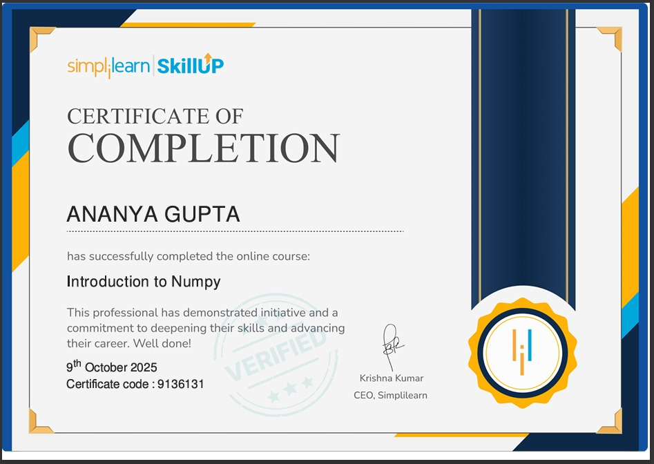

  

  

  

---

## 🧠 System Profile

| Field | Info |
|-------|------|
| **Name** | Ananya Gupta |
| **Role** | Data Science Student |
| **Focus** | AI · RAG · LLM · Analytics |
| **Status** | Building AI Projects 🚀 |

---

## 🛠️ Tech Stack

**AI / ML**

**Data**

**RAG / Vector**

**Tools**

---

## 🚀 Featured Projects

| 🤖 AI Meeting Assistant | 📄 Chat with PDF (RAG) |
|---|---|
| Real-time transcription | Document-based Q&A |
| AI summaries & Q&A | Vector search |
| Built with Whisper + GPT | Built with FAISS + LangChain |

---

## 🏆 Certifications

<table>
  <tr>
    <td align="center">
      
       <b>NumPy</b>
    </td>
    <td align="center">
      
       <b>Python for Data Science</b>
    </td>
    <td align="center">
      
       <b>Machine Learning</b>
    </td>
    <td align="center">
      
       <b>AI Fundamentals</b>
    </td>
  </tr>
  <tr>
    <td align="center">
      
       <b>SQL & Databases</b>
    </td>
    <td align="center">
      
       <b>Data Analysis</b>
    </td>
    <td align="center">
      
       <b>Data Visualization</b>
    </td>
    <td align="center">
      
       <b>Data Science Capstone</b>
    </td>
  </tr>
</table>

---

## 📊 GitHub Stats

  
  

---

## 📅 Contribution Graph

  

---

## 🧠 AI Philosophy

> *"Building systems that don't just run — but think."*

---

## ⚙️ System Status

| 🟢 Status | 🚀 Mode | 💡 Goal |
|-----------|---------|---------|
| Online | Building | AI Engineer |

---

  

